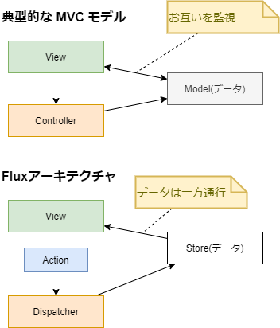

# Webアプリケーションのアーキテクチャ

筆者: 海老原 賢次（kenji.ebihara@jrits.ricoh.co.jp）  
作成日: 2021-08-18  
更新履歴:

- 2021-08-18: 新規作成

---

## 概要

ここでは、Webアプリケーションを設計する上で必要な知識について学びます。

また、よく使用される言語やフレームワーク、ライブラリについてもお話します。

**ここで書かれている評価や見解は、あくまでも個人的な経験や調査した結果での考察した上での意見であり、参考程度としてください。**

Webアプリケーションが動作するときに、どこで何がどのように処理しているのか、考えたことが有るでしょうか？

ここで、Webアプリケーションの歴史について少しお話します。

----

Webはもともと静的なHTMLファイルを表示するもので、HTMLは、文書に意味をもたせる、例えば文書のタイトルはコレだとか、これは重要な部分であるとかですが、それをルール化したマークアップ言語というもので、それ自体にアプリケーションの機能はありませんでした。

その後、CGIという仕組みにより、HTMLをサーバー側で動的に書き換えてクライアントに送ることができるようになり、HTMLもテキストボックスやボタンなどのフォームの機能を持つようになったことで、インタラクティブな処理、つまり UI を持てるようになりました。

CGIはWebサーバーのおまけ程度のもので、非常にシンプルな機能で言語も簡易なもので、たくさんのリクエストや重い処理を行うには荷が重く、複雑な処理を書くとメンテナンス性の非常に悪いものでした。
Webアプリに多くの機能を求められるようになると、CGIでは対処できなくなりました。

そうなると、Webアプリケーションに特化したサーバー製品が登場します。Java Servlet や .NET の ASP などです。

これらも、内部の動作は CGI と大きく違うものの、サーバー側で動的なHTMLを作成する、という手段はCGIと変わりませんでした。

Google が Google maps などで、クライアントスクリプトでバックグランドで通信した情報を取得し、それをもとにクライアント上で動的にHTMLを書き換える仕組みを採用し、話題となりました。

クライアント上で動的にHTMLを書き換える仕組みはそれ以前から有りましたが、せいぜい見た目を変えるだけで、バックグランドの通信と組み合わせたことで、Webアプリケーションの利便性は格段に向上しました。この仕組を当時は Ajax と言いました。

現在では更にそれを推し進めて、サーバー側には静的なベースとなるHTMLのみを置き、レンダリングは全てクライアントで行う、クライアントレンダリングの仕組みを採用することが多くなっています。これに対して、従来のサーバー側で動的なHTMLを構築することを、サーバーサイドレンダリングと呼びます。

----

サーバー側の処理に注目してみましょう。

サーバーの処理として、サーバーサイドレンダリングではHTML生成が必要ですし、クライアントレンダリングの場合はクライアントのバックグランドの呼び出しに応答する API が必要になります。

これらの実装には、言語とフレームワークが選択でき、それらによって大きく異なります。後にいくつか紹介します。

----

ブラウザ側の処理に注目してみましょう。

ブラウザで採用できる言語は JavaScript 1択です。

ブラウザ側で動的にHTMLを生成したり変更したりすることを DOM操作 といいますが、クライアントレンダリングの需要が増えるのに伴い、この DOM操作のコーディングにも問題が出てきました。

まず、JavaScriptは軽量な言語で、コンパイルや変数の型指定などが必要なく、小さいプログラムを書くには非常に効率の良いものです。Webアプリの黎明期にはそれで良かったのですが、その需要の高まりに伴い、クライアントでも大規模な開発が多くなりました。そうなると、JavaScriptの利点が欠点となってきました。

また、DOM操作も複雑になりました。原因としてHTMLとJavaScript、CSS が分離しており、大規模になるとそれらの管理が難しくなるためです。

そのため、DOM操作を行う ユーティリティやフレームワークが次々と派生することになりました。また、Alt JavaScript というコンパイルしてJavaScriptに変換する言語も登場しました。

----

ここでは、サーバーサイドレンダリングとクライアントレンダリングといった、全体的なアーキテクチャと、サーバー側のフレームワーク、ブラウザ側のフレームワークについて話をします。

## サーバーサイドレンダリングとクライアントレンダリング

Webアプリケーションが動作するときには、どんな処理がどこで動いているのでしょう。

システムの目的や仕組みによって様々ではありますが、一般的な流れとしては、下記のようになっていると思います。

- データベースとの I/O
- ビジネスロジックの処理
- HTMLの生成
- HTMLの表示

このうち、HTMLの表示はブラウザが行います。

サーバーサイドレンダリングでは、HTML生成までを役割として担います。

クライアントレンダリングでは、HTMLの生成をブラウザの処理で行います。

### サーバーの負荷の違い

サーバーの処理の負荷を考えると、一見してわかるように、クライアントレンダリングのほうが軽いです。ブラウザがサーバーの負荷を肩代わりするようなものですね。

HTMLの生成処理は、複雑な画面になるほどメモリやCPUを消費します。1つのリクエストではたいしたことはなくても、1分間に数百、数千のリクエストが来る場合、レスポンスを確保するためサーバーのスペックを上げる必要があります。つまり、クライアントレンダリングに比べて運用面でコスト高となります。

### サービス指向アーキテクチャ

クライアントレンダリングを採用した場合、サーバー側はHTMLを返すのではなく、必要に応じたデータのI/Oを受け持つ API を実装し、クライアントからその API をコールすることになります。

これは、サーバーのAPIをブラウザのUIに限らずアクセスできるものなので、他のUI（例えばモバイルアプリ）や外部のシステムからも利用できるようにもなります。

別な言い方をすると、UI と サービス（機能）を分離することになり、サービス指向アーキテクチャとして設計しやすく、システムの汎用性が高まります。

ただし、サービス指向に基づいた API の設計が必要となります。

ちなみに、API設計 というのは、開発者の1つのスキルとなっており、例えば企業の求人での望まれるスキルの1つになっていたりもします。

サーバーサイドレンダリングで同様のことをしようとすると、HTMLを返すインターフェースとは別に作成する必要があり、メンテナンス性でも劣ります。

### SEO

SEO とは、Search Engine Optimization の略で、検索サイトでのヒットのしやすいように HTML などを工夫することを言います。

Google や Yahoo! などの検索エンジンの仕組みは明らかにされていませんが、自動でクローニングすることから、ブラウザでレンダリングするものに関しては、検索エンジンが見てくれない可能性が高いです。

サーバーサイドレンダリングでは、クライアント側ではそれが静的なHTMLか、サーバーで動的に作成されたかは関係ないので、検索エンジンがレンダリングした内容を読み込んでくれるでしょう。

商用サイトなどで、検索エンジンにヒットしないのは致命的な損失で、そのような場合は部分的にサーバーサイドレンダリングを行うこともあります。

### ファーストインプレッション

SEO に通じるところもありますが、はじめにサイトにアクセスして画面が表示されるまで時間がかかるとユーザーが離れていってしまいます。

社内アプリではあまり問題になりませんが、商用サイトではとても重要です。

これに関しては、サーバーサイドレンダリング、クライアントレンダリングのどちらが良いかというのは難しいです。

複雑な画面の場合、基本的にはサーバー側で静的なHTMLか、必要に応じて部分的な比較的軽い動的なHTML生成処理として、基本的にはクライアントレンダリングで行うのが良いでしょう。

その場合でも、はじめの画面が真っ白ではなく、ユーザーに少しずつでも情報を表示できるような仕組みによって、待ち時間を感じさせないような工夫があると良いでしょう。

## サーバーの言語とフレームワーク

サーバーでは、様々な言語と言語ごとのフレームワークが選択できます。

フレームワークを使わなくても、サーバー処理は実装できますが、非常に効率が悪いので、フレームワークを使うことは必然でしょう。

サーバーレンダリングに特化したものや、WebAPI に特化したもの、その両方に対応したもの、など、それぞれに特徴やトレンドがあるので、選択する際には仕様をよく確認しましょう。

言語としては、Java、Python、Ruby、PHP、JavaScript（Node.js）、.NET (C#, VB.NET) などがメジャーです。

### Java

Java は、過去のものも含めると最も実績のあるものでしょう。開発者も他と比べても最も多いでしょう。

Webフレームワークとしてはサーブレットという仕組みの上にフレームワークを導入するのが一般的です。このフレームワークにもいくつもの種類があり、Spring やStruts といったものがメジャーなものだと思います。

### Python

Python は最近最も人気のある言語です。が、すみません、あまり知識ないです。Webのフレームワークとしては、Django, Flask というものがあるようです。

### Ruby

Ruby は一時開発者の間で人気のあった言語で、今でも多くのサーバーで動作しています。手軽に始められるので、スタートアップ企業で採用されることが多いです。

Webのフレームワークとしては、Ruby on Rails や Sinatra がよく採用されるようです。

### PHP

PHP は、CGI に変わる言語として、古くから利用されてきました。歴史はありますが、現在でもバージョンアップを続けており、現役で動作しているものも多いと思います。

とはいえ、最近の言語が null safety など先進的な機能を取り込む中で、レガシーになっていることも事実ですので、新規のプロジェクトに積極的に採用することはないでしょう。

PHPは、もともとHTMLのレンダリングのための言語なのでフレームワークを使わない場合も多いと思います。といっても、フレームワークが無いわけでもなく、Laravel, CakePHP などを利用することもあるようです。

[PHP: Hypertext Preprocessor](https://www.php.net/)

### Node.js

Node.js は、サーバーサイドで動作するJavaScript で、ブラウザと異なりOSのファイルやプロセスの操作などもできます。
他と異なり、Webクライアントと同じ言語で書けるので、学習コストが低く、非常にメリットがあります。

Webフレームワークとしては、AdonisJs, Express.js がよく使われます。

[Node.js](https://nodejs.org/ja/)

### .NET

.NET は、マイクロソフトが開発している、クロスプラットフォームの実行環境です。C# や VB.NET などの複数の言語が提供されており、開発者も多いです。

Webのフレームワークとしては、ASP.NET や ASP.NET MVC、API.NET Web API などがあります。Windows Server のWebサーバー IIS 上で動作させるのが一般的です。Linux 上でも ASP.NET Core を利用して動作できるようですが、事例はあまりないかと思います。

[.NET | Free. Cross-platform. Open Source.](https://dotnet.microsoft.com/)

## Webクライアントのフレームワーク

### レンダリングフレームワーク

Webクライアントのレンダリングのフレームワークでは、DOM 操作や管理を如何に簡単に行うことができるか、というところが要点になります。

#### jQuery

10年くらい前までは jQuery が多く使われていました。jQuery は冗長的な DOM操作を簡単に記述でき、機能も豊富で非常に人気がありました。
現在もまだ利用しているところも多いかと思います。

しかし現在のおいては、脱 jQuery が叫ばれるようになりました。

原因は、Webアプリの複雑性に伴い、その管理が煩雑になってしまったことです。どこで何の DOM操作が行われているのか、データと処理と出力の因果関係がわかりづらくなってしまいます。これは、jQuery があくまでも DOM操作の延長線上のものであり、HTMLと処理が分離してしまっていることに起因します。

[jQuery](https://jquery.com/)

#### React

React は、上記の問題をコンポーネントという概念を用いて解決しました。コンポーネントはWebをパーツ化して、それぞれのパーツで与えられたデータをもとに動的にレンダリング結果を出力することができます。1つのファイルに処理とレンダリング結果を記載でき、それをパーツとして組み立てるように構築できます。

コンポーネントの単位で管理できるので、処理と出力の因果関係が明確で、メンテナンス性が非常に向上します。大規模なWebアプリでもコンポーネントに分割することで、管理がしやすく拡張性も持てる、非常に良いフレームワークです。

そのため、React は今最も人気のあるフレームワークと言って良いでしょう。

[React – ユーザインターフェース構築のための JavaScript ライブラリ](https://ja.reactjs.org/)

#### Vue.js

Vue.js は、React よりも後発のフレームワークです。React はコンポーネントによって管理がしやすくなった反面、いままでの DOM操作とはまるで異なる処理を書くことになりました。その学習コストはやや高く、jQuery に馴染んでいた人にとっては難しいものでした。また、jQueryで書かれたコードを React に移植するには、ほぼすべてのコードを書き換えることになります。

Vue.js は、HTMLが中心のDOM操作ができる部分を残しつつ、ゆるいコンポーネントも作れる、といった感じでしょうか。規模が小さい場合や jQuery からの移行には、React は冗長的で、Vue.jsが望まれると思います。

[Vue.js](https://jp.vuejs.org/index.html)

#### AngularJS / Angular

AngularJS / Angular は、Google が開発した Webフレームワークです。AngularJS が version2 で大きく仕様が変わったことから、Angular に名前が変わりました。

レンダリング部分だけでなく、下で説明している データフローの機能など併せ持っており、フルスタックなフレームワークと言えます。また、TypeScriptで書くことが前提、DI（依存性注入）の思想に則って仕様が策定されている特徴もあります。

一時は利用が広まったのですが、多機能であるがゆえに仕様が複雑で、学習コストが高いことが課題であり、React / Vue.js にくらべシェアを落としています。

React / Vue.js は、レンダリングのみに特化していて、他の機能は別のライブラリを選定して組み合わせる、という手間はありますが、必要最低限であり機能同士の境界線がはっきりしているので、仕様もそれぞれで理解すればよいため、特に小規模で始めるようなプロジェクトではフルスタックなフレームワークより、このやり方のほうが向いているでしょう。

### データフロー・フレームワーク

Webクライアントアプリでは、サーバーサイドレンダリングではデータフローはあまり考えられてきませんでしたが、クライアントレンダリングだとサーバーから送られてくるのはデータなので、クライアントでそのデータをどう保持して、レンダリング・フレームワークにどう渡すのかを検討する必要があります。

#### Flux

上でも紹介した、Angularはレンダリングとデータの管理を併せ持ったもで、レンダリングとデータ(Model)を相互に参照するものです。例えばテキストボックス、Modelのプロパティが指定してあり、そのデータが表示される、変更したらModelが変更される、Modelが変更されるとそれを参照しているテキストボックスやレンダリング（例えば表示・非表示が切り替わるなど）します。

一見、シンプルで当たり前のような仕様なのですが、レンダリングするもの（部品）が増えるとそれに対となるモデルも増え、データを処理する（データの取得、保存、変更管理）複雑度が上がります。

Flux はこのような問題を改善するために考えられたアーキテクチャです。

[Fluxとはなんなのか - Qiita](https://qiita.com/knhr__/items/5fec7571dab80e2dcd92)

[Flux パターンが解決した課題 - ROXX開発者ブログ](https://techblog.roxx.co.jp/entry/2019/06/12/134154)

Flux とは、データフローのアーキテクチャの概念の定義です。ライブラリの名前では有りません。

Flux では データの流れは、1方向で単純です。View はデータのインプットしかなく、Viewでの変更は、何をする、というTypeとそのための必要な情報を持った Action を Dispatcher に送られます。Dispatcher は ActionのTypeによって、Store を更新します。View は Dispatcher の処理の内容はには感知しません。

Store の変更はそれを参照している View に渡され、View はそれに応じて表示を変更します。

つまり、View はもらったデータに応じて描画する、ということに専念できます。また、それぞれの役割分担が明確になり、ソースコードの管理がしやすくなります。

Flux のアーキテクチャを実現したフレームワークとして Redux があります。これについては、ライブラリの章でお話します。

## テストフレームワーク

現在の開発では、ユニットテスト・フレームワークを利用して、テストプログラムを書くことは、当たり前になってきています。

テストプログラムを作成するには、それなりのスキルが必要ですが、開発者は当然のように身につけておくことが今後必要になるでしょう。

言語ごとに複数のテストフレームワークがあり、より良いものを選択する必要があります。

Java であれば、JUnit、.NET であれば、xUnit, NUnit、がよく使われると思います。

JavaScript でも様々なフレームワークがありますが、Jest が抜きん出ていてスタンダードになっています。

[Jest · 🃏 Delightful JavaScript Testing](https://jestjs.io/ja/)

[jestでユニットテスト基礎 - Qiita](https://qiita.com/jintz/items/61af86a12b53b24ef121)

## 開発環境

Webアプリ開発は、ツールを使わない場合は、極端な話ですがメモ帳があればできます。

ですが、もちろん効率が悪いので、様々なツールを使います。

### node.js

サーバー環境のところでも出てきましたが、開発環境でも利用します。モダンなWeb開発としては必須です。

node.js がないと、npm も使えません。

また、TypeScript のコンパイラや、webpack といったツールも node.js 上で動作するものなので、必須となります。

JavaScript で簡単に処理が書けるので、ビルドなどで独自のバッチなども作ることも多いです。

### Visual Studio Code

マイクソフトが無償で提供している、ソースコードエディタです。

同類のツールは多数ありますが、抜きん出て人気があります。下記の特徴があります。

- Windows, Linux, macOS のマルチプラットフォーム
- デバッグ機能付き（環境整備が簡単でない場合もあります）
- Gitの操作（commit, pull などほどんどのコマンド）が可能
- 豊富な拡張機能
- 多くの言語に対応したコードハイライトやスニペットなど
- TypeScript の標準対応と、バージョンアップの早期対応
- 豊富なカスタマイズ項目
- 軽量な動作
- Docker のサポート（Docker内にリモートで入るなど）

[Visual Studio Code – コード エディター | Microsoft Azure](https://azure.microsoft.com/ja-jp/products/visual-studio-code/)

----

この下は、完全に開発者の好みの問題です。

### [参考]ソースコード用フォント

Windows であれば、Consolas という等幅フォントが、ソースコードの用として入っています。

それよりもソースコードに適した、より良いフォントがたくさんあります。これらのフォントの特徴として、下記が挙げられます。

- 視認性の向上
  - 等幅で適切な間隔がある
- 間違いの気付き
  -  0(ゼロ)やO(オー)、l(エル),I(アイ),1(いち)などの判別がつきやすくなっています。  
- 合成文字によるわかりやすさ
  - フォントにもよりますが、例えば !== とうつと ≠ と見える（見えるだけでデータは !==）ものなどがあります。

ちょっとしたことなのですが、開発者として生産性を上げるために、フォントにはこだわりましょう！

おすすめのフォント

- [Fira Code](https://github.com/tonsky/FiraCode/releases)
  - 日本語には対応していませんが、合成文字でわかりやすい表示が特徴です。
  - 日本語に対応していないですが、表示できないわけではなく、別のフォントで表示されます。

- [source-han-code-jp](https://github.com/adobe-fonts/source-han-code-jp/releases/tag/2.012)
  - 日本語にも対応している、等幅なソースコード用フォントです。
  - エディタで日本語のズレが気になる場合は、これを使ってみてください。

- [Nasuフォント ： 見た目が似ている文字を判別しやすくするフリーフォント](https://itouhiro.hatenablog.com/entry/20140917/font)
  - 上のフォントを元に、日本語を見やすくしたフォントです。
  - たとえば、「ぱ」と「ば」 など濁音、半濁音が見やすく設計されていたりします。
### [参考]キーボード

一日のほどんどの時間、PCに向かっている開発者にとって、キーボードの性能は、ちょっとの差であっても生産性に影響します。

キーボードの性能によって、打ちやすさ、疲れのたまり具合、打ち間違いにくさなど変わります。安いものだと、タイピング速が早すぎてご動作するものもあります。

普段意識していなくても、変えてみたら楽になって、というこもあるでしょう。

開発者であれば、メカニカル式や静電容量無接点方式がおすすめです。値段は 1～2,3 万くらいするので、高いと思うかもしれませんが、長く使うものだからこそ、良いものを選びたいです。

メカニカル式は、軸の種類によってしっかりした打ち応えの有るものから、軽いもの、カチッというクリック感があるもの、静音性に優れたものなど様々で、自分の好みの軸を選ぶことが出来ます。

[CHERRY MXスイッチとは | ダイヤテック株式会社](https://www.diatec.co.jp/products/CHERRY/)

上のメーカーのブランドである FILCO が人気だと思います。ちなみに筆者は、ここの青軸が好きで愛用しています。

静電容量無接点方式は、その名の通り電極の接触ではなく、電極同士が一定距離に近づいたときの変化を検知するものです。ですので、軽いタッチで疲れなく正確に打つことができます。

メカニカル式にくらべ価格が高いのですが、非常に人気があります。

[PFUのHHK]([Happy Hacking Keyboard｜PFUダイレクト](https://www.pfu.fujitsu.com/direct/hhkb/))(ハッピーハッキングキーボード)が代表ですね。

また、キー配列も日本語キーボードよりUSキーボードをオススメします。

コーディングでは、通常の文書と個なり、カッコ (), {},[] や :; などの記号を大量に打ちます。USキーボードの方が、それらが合理的に配置されていたり、ホームポジションがキーボードの中央であること、右手の位置からEnter(日本語だと Return) キーの位置が近くいことから、USの方が打ちやすいです。

日本語キーボードからの乗り換えの際は、記号の配置が異なることに不安があるでしょうけど、3日も打っていると慣れます。（個人差はあります）

### [参考]マウス/トラックボール

開発者がキーボードの次に多く触っているのは、マウスでしょう。

ものすごく個人的な見解ですが、マウスよりトラックボールをおすすめします。

理由は疲れにくさです。

最近は、マルチモニターであったり、大型のモニターを使うことが多いです。

そうなると、マウスカーソルの移動が多くなります。マウスだと移動量が多くなり、場合によっては机が狭く何回か持ち上げ置き直すことになるでしょう。机が広くても腕の伸び縮が大変です。手首への負担も増えます。

トラックボールは、腕の位置を変えないまま広い範囲を移動できるので、腕や手首への負担が有りません。

実際、筆者もマウスで手首が痛くなり作業効率が大幅に下がったため、トラックボールに乗り換えて改善しました。

また、マウスだとクリックした瞬間にずれちゃった、ということないですか？

トラックボールなら、ボールから指を離せばポインタが動くことが有りません。

トラックボール使ってみたけど、ポインタを細かく動かせない、という人が多いですが、それはポインタの速度がトラックボールにあってなく、早すぎるためです。

トラックボールでは、ポインタの速度を大きく下げて、ボールをグリグリ動かして使うものです。あなたが思うよりもたくさんグリグリして使います。

1週間もすれば慣れます。（個人差があります）

## まとめ

余談も含みましたが、Webアプリケーションにおける構成、環境等の概要が把握できたでしょうか？

トレンドによっては、今後も部分的に変わっていったりします。特にWebアプリケーションは、いろいろなものを組み合わせて動作したり作っていくものなので、それぞれが別のものに入れ替わったりします。

現在のトレンドを踏まえ、将来トレンドになりそうなものをキャッチアップできるよう、アンテナを広げておくことが必要です。
