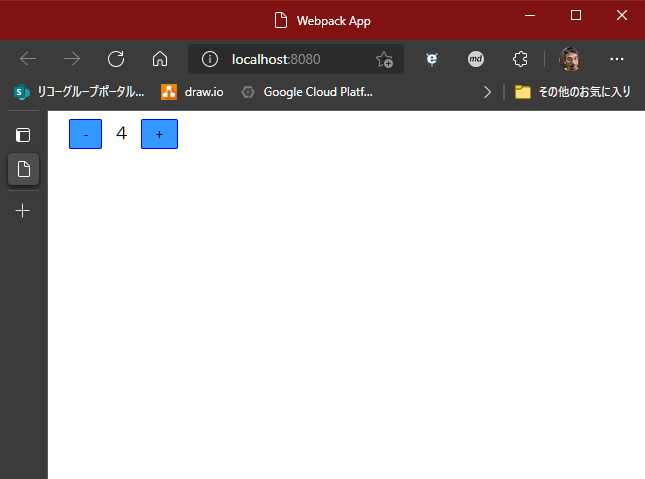

# React の特徴と演習

ホームページ: [React – ユーザインターフェース構築のための JavaScript ライブラリ](https://ja.reactjs.org/)

GitHub: [facebook/react: A declarative, efficient, and flexible JavaScript library for building user interfaces.](https://github.com/facebook/react/)

React は、Facebook が作ったフレームワークです。今最もメジャーなライブラリだと言っていいでしょう。

React の公式ページでは、3つの特徴があるとしています。それは、React の設計思想、モチベーション、ということになるかと思います。

１つずつ見てみましょう。

## React の特徴

### 宣言的な View

宣言的とはなんでしょうか。宣言的の反対は、手続き的、と言えるでしょうか。

なにをするか、ではなく、何がやりたいか（何をやるのか）が明確だということとも言えるかもしれません。

!!!note:
[宣言的？ Declarative?どういうこと？ - Qiita](https://qiita.com/Hiroyuki_OSAKI/items/f3f88ae535550e95389d)

React では、データを受け取って、それに従って描画するということに専念します。データの変更も自動で検知して、再レンダリングされるので、その処理を意識することは有りません。

コードの見通しがよく、管理がしやすくなります。

### コンポーネントベース

React は、Webページを複数のパーツに分けて管理します。共通化される場合もありますが、管理のために分けることも多いです。

このパーツのことをコンポーネントと読んでいます。

コンポーネントに分けることで、その中でそれぞれの状態や処理を持つことが出来、カプセル化されます。単純化したコンポーネントを組み合わせることで、複雑な画面を作ることが出来ます。

また、HTMLもテンプレートを持つのではなく、そのコンポーネントの中で生成するので、入力値、状態によって、どのような出力がされるのかをコンポーネントの単位で把握できるので、非常に管理がしやすくなります。

### 一度学習すれば、どこでも使える

どこでも、というのはちょっと大げさですが、React は Webブラウザアプリで使うことが主ですが、サーバーサイドレンダリングでも使用できます。(要 Node.js)

また、`React Native`プラットフォームでは、React を使って、まるでWebアプリケーションを作るような感じで、モバイルのネイティブアプリ（しかも、iOS, Android ハイブリッド！）を作成することが出来ます。

## React の演習

といっても、言葉では伝わりにくいので、実査に書いてみるのがいいですね。

ここでは、簡単にカウンターのアプリを作ってみます。

＋ボタンを押すと数字が足され、－ボタンを押すと減る、という単純なものです。

ここでのコンポーネントは、数値部分、ボタン部分、数値とボタンを組み合わせた部分
と3つに分けます。ボタン部分は、共通のコンポーネントとします。

細かすぎる感じがしますが、実際でもこのくらいまで細かくすることも多いと思います。

### 準備

空のフォルダから始める場合は、前のセクションを参照して、`npm init`(`yarn init` でも可) と `webpack init` を作成してください。webpack では、TypeScript と React を使うようにします。

webpack のウィザードの選択肢

<pre>
? Which of the following JS solutions do you want to use? <span style="color: blue">Typescript</span>
? Do you want to use webpack-dev-server? <span style="color: blue">Yes</span>
? Do you want to simplify the creation of HTML files for your bundle? <span style="color: blue">Yes</span>
? Do you want to add PWA support? <span style="color: blue">No</span>
? Which of the following CSS solutions do you want to use? <span style="color: blue">none</span>
? Do you like to install prettier to format generated configuration? <span style="color: blue">Yes</span>
? Pick a package manager: <span style="color: blue">yarn</span>
[webpack-cli] ℹ INFO  Initialising project...
 conflict package.json
? Overwrite package.json? <span style="color: blue">overwrite this and all others</span> # 'a' をタイプ
</pre>

React と関連するライブラリをインストールします。

```bash
yarn add react react-dom
```

TypeScriptのための型定義もインストールします。`-D` を忘れないようにします。

```bash
yarn add -D @types/react @types/react-dom
```

TypeScript で後述する `JSX` を利用するので、`tsconfig.json` にそのオプションをつけておきます。また、   "moduleResolution" に "node" を、"files" も `src/index.tsx` としておきます。

`index.ts` のファイル名も `index.tsx` に変えておきます。

```json
{
  "compilerOptions": {
    "allowSyntheticDefaultImports": true,
    "noImplicitAny": true,
    "module": "es6",
    "target": "es5",
    "jsx": "react",
    "allowJs": true,
    "moduleResolution": "node"
  },
  "files": ["src/index.tsx"]
}
```

`webpack.config.js` の entry も変更しておきます。

```js

const config = {
  entry: "./src/index.tsx",
  // ...省略
};
```


以上で、準備はできました。

### 数値を表示するコンポーネントの作成

まず、数値の表示部分を作ります。ここでは、外から数値を受け取って、それをレンダリングすることだけを考えます。

ファイルは、`src/DisplayNumber.tsx` とします。拡張子が `.tsx` であることに注意してください。

```tsx
import React from 'react';

type PropType = {num: number};

export const DisplayNumber: React.FC<PropType> = props => {
  return <span>{props.num}</span>;
};
```

はじめに `React` をインポートしています。これは、コンポーネント作成する上で必須になります。

type は、外部からどのような値を受け取るか、その値のオブジェクトの型を宣言しています。

その下がコンポーネントの定義になります。このように、関数で定義します。

export とつけるのは、このコンポーネントを使う側が import でこの関数を参照できるようにするためです。

関数の引数には、外部からの値=プロパティが入ります。React.FCの < > には、そのプロパティの型を定義しているわけです。

関数の戻り値となる `return` には、HTMLのタグがまんま入っているように見えます。これは、JavaScript 内で、DOM（HTMLタグ）のようなものを書くことができる書式です。

これは、JSX と呼ばれる記法です。拡張子を `.tsx` としたのは、TypeScript の JSX で書かれることを表しています。

React は、JSX 記法でなくても書けるのですが、こちらのほうが直感的だと思います。

JSX 内では、{ } に変数や関数を書くことができ、動的な値を出力するときに使います。

JSX で書かれたタグは、仮想DOM と呼ばれますが、HTMLと異なるところがあります。例えば属性に `class` がありますが、それはJavaScript の予約語となっているため、`className` となります。

また、仮想DOM はオブジェクトでも有るため、下記のように変数に入れることが出来ます。不特定の数を出力するときなど、これを配列として使ったりします。

```tsx
const numberElement = <span>{props.count}</span>;
```

!!!note
    [JSX の導入 – React](https://ja.reactjs.org/docs/introducing-jsx.html)

### ボタンのコンポーネントの作成

ボタンは、＋および－で共通で使われることとします。ただし、ボタン上の表示と処理が異なります。

処理は、数値に +1 するか、-1 にするか、ですが、その数値自体はこのボタンで管理するものではありません。このボタンを使う側で管理するものです。

したがって、ボタンを押したときに何をするのか＝関数、を使う側からもらうようにしましょう。

プロパティとしては、ボタン上の文字（キャプション）とボタンを押したときの処理が書いてある関数とします。

`src/IncrementButton.tsx`  ファイルを作成します。

```tsx
import React from 'react';

type PropType = {
  caption: string,
  onClick: () => void;
}

export const IncrementButton: React.FC<PropType> = props => {
  return <button onClick={props.onClick}>{props.caption}</button>
};
```

HTMLの属性にも { } で動的に値を渡すことが出来ます。

このように、コンポーネントの引数に関数を入れることができるため、外から振る舞いを変える（依存性の注入: DI とも言います）ことが簡単にできます。

### 数値表示とボタンを組み合わせたコンポーネントの作成

これまで作ったコンポーネントを組み合わせたコンポーネントを作ってみましょう。

`src/Increment.tsx` ファイルを作成します。

また、カウントする数値はこのコンポーネント内でその値（状態）を管理します。よって、外部から値を受け取る必要はありません。

```tsx
import React, { useCallback, useState } from "react";
import { DisplayNumber } from "./DisplayNumber";
import { IncrementButton } from "./IncrementButton";

export const Increment: React.FC = () => {
  const [counter, setCounter] = useState(0);
  const increment = useCallback(() => {
    setCounter(counter + 1);
  }, [counter, setCounter]);
  const decrement = useCallback(() => {
    setCounter(counter - 1);
  }, [counter, setCounter]);
  return (
    <div>
      <IncrementButton caption="-" onClick={decrement} />
      <DisplayNumber num={counter} />
      <IncrementButton caption="+" onClick={increment} />
    </div>
  );
};
```

import で作ったコンポーネントを参照します。

コンポーネントは、JSXのタグとして使用できます。このとき、プロパティを属性として渡します。

管理する数値を、`useState` で宣言します。引数は初期値です。

`useState` の戻り値はタプル型の配列で、1番目に状態の値（state, ここでは数値）、2番目に状態の値を変更するための関数となります。

状態（state, 値）を変える場合、値の変数を直接変更するのではなく、必ずこの関数を使う必要があります。

`useCallback` で、state の値に +1, -1 する処理を宣言しています。

この useCallback, useState については、この下の「[React のパフォーマンスと Hooks](#hooks)」で説明します。

### HTMLへの挿入

コンポーネントは作りましたが、それをHTMLのどこに当てはめるのか、ということが必要です。

また、それを行うファイルこそがアプリの起点（はじめに読み込まれるファイル）となります。

まず、`index.html` に、React のコンポーネントが描画される場所を作りましょう。

```ts
<!DOCTYPE html>
<html>
    <head>
        <meta charset="utf-8" />
        <title>Webpack App</title>
    </head>
    <body>
        <div id="app"></div>
    </body>
</html>
```

id が "app" の div 要素に React をレンダリングするようにしましょう。

`index.tsx` を作成します。

```ts
import React from "react";
import { render } from "react-dom";
import { Increment } from "./Increment";

render(<Increment />, document.getElementById("app"));
```

ここでも、コンポーネントを import して、render に渡すだけです。

描画先となる、HTMLの DOM を 通常のWebアプリでよく見る `document.getElementById` を使って取得しています。

これで完成です。ターミナルから `yarn serve` を実行してみましょう！

このように動作したでしょうか。


### CSS in JS でスタイルを定義してみる

ボタンも小さくて、それぞれの隙間がなくて操作しづらいので、スタイルで調整してみましょう。

以前のセクションで CSS in JS のライブラリとして紹介した、"Emotion" を使ってみましょう。

何はさておき、インストールです。

```ps1
yarn add @emotion/react
```

ボタンにスタイルを割り当ててみましょう。`IncrementButton.tsx` を開きます。

```ts
/** @jsx jsx */
import { css, jsx } from "@emotion/react";

const styles = {
  button: css`
    background-color: #3399ff;
    border: 1px solid blue;
    margin: 0 1em;
    padding: 0.5em 1em;
  `,
};

type PropType = {
  caption: string;
  onClick: () => void;
};

export const IncrementButton: React.FC<PropType> = (props) => {
  return (
    <button css={styles.button} onClick={props.onClick}>
      {props.caption}
    </button>
  );
};
```

1行目のコメントは、emotion を使うにあたって必要なもので、これがあることで、仮想DOMに本来無い `css` の属性が適用できます。また、React のインポートも必要なくなります。

emotion から参照した、`css` という関数でスタイルを定義します。

この関数に [タグ付きテンプレート](https://developer.mozilla.org/ja/docs/Web/JavaScript/Reference/Template_literals#tagged_templates) として、文字列で CSS を渡します。

ここでは、style というオブジェクトを定義して、その中でスタイルを定義していますが、直接変数に与えても構いません。ただ、コンポーネントの中で複数のスタイルを扱う場合、このようにオブジェクトにまとめておいたほうが、管理しやすいと思います。

スタイルを 仮想DOMに割り当てるには、タグの属性 `css` に定義した値を与えるだけです。

保存して実行してみましょう。スタイルが適用されました。



通常の HTMLとCSS を使ったスタイル定義では、それぞれ別のファイルに分かれて書きます。

そうすると、CSS の中で定義しているクラスなどが、どこで使われて、変更がどこに影響があるのかを管理するのが難しくなります。

React のコンポーネント内にパッキングすることで、部品とスタイルが同じところで管理されるため、関係性が非常にわかりやすくなります。

### React のパフォーマンスと Hooks<a id="hooks"></a>

上のコードは、`useCallback` を使わずに、下記のように書いても動作します。

```tsx
  // ❌ 良くない例です
  const increment = () => {
    setCounter(counter + 1);
  };
  const decrement = () => {
    setCounter(counter - 1);
  };
  return (
    <div>
      <IncrementButton caption="-" onClick={decrement} />
      <DisplayNumber num={counter} />
      <IncrementButton caption="+" onClick={increment} />
    </div>
  );
```

ただし、この書き方はパフォーマンスが低下します。

仮想DOM 自体や、仮想DOMのプロパティ（属性）に割り当てられている値（オブジェクト）が変わると、再レンダリング（DOMを作って置き換える）されます。

再レンダリングされるときには、コンポーネントの関数の作成と割り当てが毎回実行される、ということになります。

上の例では、Increment コンポーネントが再レンダリングされると、increment や decrement 関数が実行されるたびに再定義されます。

関数の内容が同じではありますが、関数オブジェクトとしては、毎回新しく作り直すことになるので、別なものとして認識されます。


よって、必要のないレンダリングが発生することになります。

`useState` や `useCallback`  を使うことで、そこで宣言したものは [メモ化](https://qiita.com/seira/items/42576765aecc9fa6b2f8#%E3%83%A1%E3%83%A2%E5%8C%96%E3%81%A8%E3%81%AF) され、**必要のない限り** 再生成しないようになります。

**必要のない限り**、と書きましたが、どういった時に再生成が必要か、と疑問に思うでしょう。

関数の中で使用しているその外側の変数（上の例では、setCounter, counter）は、それを生成したときの値に固定され、いくらその値を書き換えても、その関数の結果は同じものを変えします。

useCallback の関数のあとにある第2引数の配列(`[counter, setCounter]`)は、それらの値が変更された時にその関数を作り直す、ということをします。

また、「値が変更される」というところも重要で、プログラム的には `===` で比較して同じかどうかを判断します。これは、オブジェクトの時に重要で、オブジェクト同士の比較は、同一オブジェクトかどうか、という判断になります。

同一オブジェクトかどうか、という判断についても正しい認識が必要です。この下の解説を参考にしてください。

`useState` についても、コンポーネント関数が複数回呼ばれても保持した値が（同一オブジェクトとして）変わらないようにするものです。値を変更する場合は、`useState` の戻り値の配列の２つ目の関数（ここでは、setCounter）を使う必要があります。

## 関数やオブジェクトの同一性

下の例を見てください。

```ts
const obj1 = { name: 'ricoh01' };
const obj2 = obj1;
obj2.name = 'ricoh02';
console.log(obj1 === obj2); // true
console.log(obj1.name); // "ricoh2"
const obj3 = { name: 'ricoh02' };
console.log(obj3 === obj1); // false
```

`obj2` は、`obj1` を代入してあり、これは同じオブジェクトを指し示しているので、比較結果は `true` となります。また、obj2 で変更したプロパティは obj1 も影響受けます。繰り返しになりますが、これはメモリ上のオブジェクトを参照しているからです。

`obj3` は中身は同じですが、別に生成されたものなので、比較結果は `false` となります。

このように、オブジェクトの場合は、オブジェクトの扱いの意識を正しく持つ必要があります。


!!!note
    尤も、このようなオブエジェクトの同一性に関しては React を使う上だけではなく、JavaScript を含め、Java や C# など他の言語、プラットフォームでも同様ですので、プログラマとして正しく把握しておく必要があるものです。  
    ただ、値渡し、参照渡し、といった議論になると、JavaScript 自体が他とは違いちょっと特殊です。詳しくは、下記参考のリンク先で勉強してください。

React では、今回の例のように小さい規模のものであれば問題はないですが、規模が大きくなるに連れ、影響は大きくなります。例えば、テキストボックスに1文字入力するたびに画面全部が再描画され、使い物にならない、ということにもなりますので、**この理解は重要です**。

!!!参考
    [フック早わかり – React](https://ja.reactjs.org/docs/hooks-overview.html)  
    [5歳娘「パパのReact、めっちゃ遅いね！」 - Qiita](https://qiita.com/Yametaro/items/621bfd8c894f8fd36539)  
    [JavaScriptはオブジェクトについて参照渡しだなんて、信じない - Qiita](https://qiita.com/mozisan/items/1b9d4bf5a1bb341dd354)  
    [JavaScriptに参照渡し/値渡しなど存在しない - Qiita](https://qiita.com/yuta0801/items/f8690a6e129c594de5fb#%E3%83%97%E3%83%AA%E3%83%9F%E3%83%86%E3%82%A3%E3%83%96%E5%80%A4%E3%81%AF%E5%80%A4%E6%B8%A1%E3%81%97%E3%81%A8%E8%A8%80%E3%82%8F%E3%82%8C%E3%81%A6%E3%81%8D%E3%81%9F%E3%82%82%E3%81%AE)
