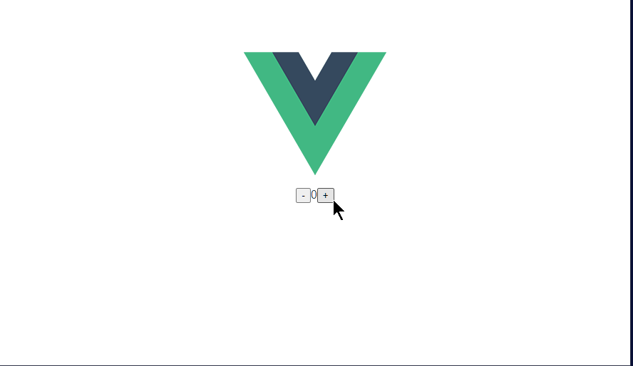
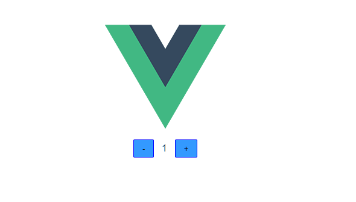

# Vue.js

## 概要

[Vue.js](https://jp.vuejs.org/index.html)

Vue.js は React と同様に、動的な HTML をレンダリングするWeb UI フレームワークです。

特徴として、下記が挙げられています。

- 親しみやすい: HTML, CSS, JavaScript を知っていれば、基本的な使い方の習得は早い
- 必要なものがはじめから揃っている（CSS in JS、SPAなど）
- サイズが小さい

PHPのように HTML 内に直接動的なHTMLを入れることも可能ですし、React のようにコンポーネントでのコーディングも可能です。

このように、書き方に幅があるので、jQuery を利用していたプロジェクトを移行するとしたら、React よりも Vue.js の方が容易でしょう。

ただし、コードの保守の効率性を考えると、コンポーネント化というのは避けられません。

コンポーネントベースで作成していくとなると、React と同等の学習コストはかかります。

実際に書いてみます。

## 演習

### 準備

Vue.js のスターターキットがあるので、それを利用しましょう。

そのツールをインストールします。フォルダには影響ないのでどこでも構いません

```
yarn global add @vue/cli
```

global を指定すると、そのフォルダではなく、どこからでも使える領域にインストールされます。

プロジェクトを作成します。

```
vue create vue-practice
```

ウィザードが開始します。Default はいろいろなライブラリを選択せずに簡単に作れるモードですが、TypeScriptを選択したいので、"Manually select features" を選択します。

```
❯ Manually select features 
```

機能を選択しますが、デフォルトのものに `TypeScript` を追加して、enter を押します。

ここでは、コンポーネントの扱いが大きく変わった 3.x をベースにしたいと思いますので、vue.js のバージョンは、3.x を選択します。

class-style のコンポーネントは No、`Use Babel ...` は、Yes としておきます。

ESLint は、 `+ Prettier` を選択します。

あとは、デフォルトのままでいいでしょう。

初期化が終わったら、サンプルのアプリを起動してみます。

```
cd vue-practice
yarn serve
```

ブラウザで、`http://localhost:8080/` にアクセスして、「Welcome to your Vue.js + TypeScript App」 とページが出てきたら OK です。

React と同じように、カウンターのアプリを作ってみます。

### 数値を表示するコンポーネントの作成

`src/components`　フォルダに、`DisplayNumber.vue` ファイルを作成します。

まず、コンポーネントとなるHTML をテンプレートとして書きます。

数字が入る場所には、 `{{}}`とカッコでくくって、変数名 `num` をいれます。この変数は後ほど定義します。

```vue
<template>
  <span>{{ num }}</span>
</template>
```

次に処理となる Script を書きます。これも `<script>`タグでくくります。`lang='ts'` とすることで、TypeScript で書くことを意味します。

まず、Vue を インポートしておきましょう。

```ts
import Vue from "vue";
```

プロパティの型定義を行ないます。ここでは、表示する数値を受け取ります。

```ts
type Props = {
  num: Number;
  required: true;
};
```

次にコンポーネントの定義となるオブジェクトを定義し、それを export default として公開することで、Vue.js からコンポーネントと認識されます。

このオブジェクトの型として、Vue.Component を指定することで、プロパティが参照入力できます。また、ジェネリックとして、プロパティの型を指定することで、この中で定義するプロパティの型を特定することが出来ます。

プロパティは `props` で定義します。 

ファイル全内容

```vue
<template>
  <span>{{ num }}</span>
</template>

<script lang="ts">
import Vue from "vue";
type Props = {
  num: number;
};
export default {
  props: {
    num: {
      type: Number,
      required: true,
    },
  },
} as Vue.Component<Props>;
</script>

```

これで、プロパティを持ったコンポーネントの完成です。

### 増減ボタンコンポーネントの作成

次にボタンコンポーネントを作ってみます。

`components` フォルダに、`IncrementalButton.vue` ファイルを作成します。

まず、テンプレートを作成します。動的な箇所は後から書きましょう。

```vue
<template>
  <button type="button"></button>
</template>
```

スクリプトを書きます。

プロパティとしては、ボタンの表示文字=キャプションと、クリックしたときの処理、つまり関数を受け取ります。

クリックしたときの処理は、`onClick` という名前にしたいところですが、DOMの持つ onClick と重複してしまうので、ここでは `onClickFn` としておきます。

先ほどと同じように、プロパティを定義します。

テンプレートで、これらを参照します。

イベントハンドラは `@click` のように前に `@` をつけるのが、vue のルールです。

caption は、前と同じく表示するだけなので、`{{ caption }}` とします。

ファイル全内容

```vue
<template>
  <button type="button" @click="onClickFn">{{ caption }}</button>
</template>

<script lang="ts">
import Vue from "vue";
type Props = {
  caption: string;
  onClickFn: () => void;
export default {
  props: {
    caption: {
      type: String,
      required: true,
    },
    onClickFn: {
      type: Function,
      required: true,
    },
  },
} as Vue.Component<Props>;
</script>
```

### 数値表示とボタンを組み合わせたコンポーネントの作成

作成したコンポーネントを組み合わせたものを作成します。

`components` フォルダに、`Counter.vue` ファイルを作成します。

テンプレートの枠だけ作成して、スクリプトを書きます。

作ったコンポーネントをインポートします。

```vue
<template>
  <div></div>
</template>

<script lang="ts">
import Vue from "vue";
import DisplayNumber from "./DisplayNumber.vue";
import IncrementalButton from "./IncrementalButton.vue";

export default {} as Vue.Component;
</script>
```

まず、テンプレートでインポートしたコンポーネントを使えるようにします。

components を定義します。ここでは、テンプレートでタグ名として使う名前と、コンポーネントを key / value で紐付けるのですが、通常は同じ名前でいいでしょう。

```ts
export default {
  components: {
    DisplayNumber,
    IncrementalButton,
  },
};
```

このコンポーネントを、テンプレートに追加します。プロパティはこの後に書きましょう。

ボタンは、数字表示を挟んで2つ必要です。それぞれ、`caption` を指定しておきましょう。

```vue
<template>
  <div>
    <IncrementalButton caption="-" />
    <DisplayNumber />
    <IncrementalButton caption="+" />
  </div>
</template>
```

このコンポーネントでは、プロパティはありません。

カウントした数値を管理する必要があります。また、カウントした数値を表示用コンポーネントに、インクリメント、デクリメントする関数をボタンに割り当てる必要があります。

そのためには、setup というプロパティを関数として定義します。

その中で、まずカウントした数値を保持する変数を定義します。

vue から `ref` を参照します。refは関数で、引数に初期値を渡します。戻り値は、ref オブジェクトで値は、`.value` に入っています。このようにする理由は、ref オブジェクト（ここでは `counter`）が不変である必要があるからです。ref オブジェクト自体が入れ替わってしまうと、テンプレートへの反映がされなくなってしまいます。

定義した値は、return でオブジェクトとして返します。ここで指定したプロパティが template で使用できます。

```ts
export default {
  components: {
    DisplayNumber,
    IncrementalButton,
  },
  setup: () => {
    const counter = ref(0);
    return {
      counter,
    };
  },
} as Vue.Component;
```

テンプレートでプロパティ `num` に `counter` を渡します。このとき、`:num` とコロンを付ける必要があります。これは、`counter` が文字列ではなく JavaScript の式として処理されることを意味します。ここでは、変数 `counter` の値がここに展開されます。

リテラルの文字以外の値を渡すときには、このようにする必要があります。テンプレートでは、refオブジェクトの `.value` を指定する必要ありません。

```vue
<template>
  <div>
    <IncrementalButton />
    <DisplayNumber :num="counter" />
    <IncrementalButton />
  </div>
</template>
```

インクリメント、デクリメントの関数も割り当てましょう。これらは、特別なことなく関数を変数に入れて、return するオブジェクトに入れるだけです。

```vue
<template>
  <div>
    <IncrementalButton caption="-" :onClickFn="decrements" />
    <DisplayNumber :num="counter" />
    <IncrementalButton caption="+" :onClickFn="increments" />
  </div>
</template>

<script lang="ts">
import Vue, { ref } from "vue";
import DisplayNumber from "./DisplayNumber.vue";
import IncrementalButton from "./IncrementalButton.vue";

export default {
  components: {
    DisplayNumber,
    IncrementalButton,
  },
  setup: () => {
    const counter = ref(0);
    const increments = () => {
      counter.value++;
    };
    const decrements = () => {
      counter.value--;
    };
    return {
      counter,
      increments,
      decrements,
    };
  },
} as Vue.Component;
</script>
```

トップページから、作成したコンポーネントを参照して表示します。

HelloWorld を消して、`Counter.vue` に差し替えます。

```vue
<template>
  <div>
    
    <div>
      <Counter />
    </div>
  </div>
</template>

<script lang="ts">
import { defineComponent } from "vue";
import Counter from "./components/Counter.vue";

export default defineComponent({
  name: "App",
  components: {
    Counter,
  },
});
</script>
```

保存して実行してみましょう。下記コマンドで簡易Webサーバーを起動して、コンパイルされます。

```
yarn serve 
```

ブラウザで、`http://localhost:8080/` にアクセスしてみます。下記のように動作しましたか？



### スタイルを適用する

ボタンが小さく、カウンタの表示と余白がほしいです。スタイルを当てましょう。

`incrementalButton.vue` でスタイルを定義します。

スタイルは、`<style></style>` タグで定義します。

スタイルはページ全体に影響しますが、`scoped` を指定することで、スタイルを書いたコンポーネント内に制限することが出来ます。通常は、これをつけたほうが良いでしょう。

`lang='sass'` を指定することで SASS 形式で書けます。SASS は、CSSを拡張した書き方で非常に便利な機能をもっているので、こちらで書けるようにしたいです。

事前にコンパイルするためのパッケージ `sass` と `sass-loader` のインストールが必要です。

```
yarn add -D sass sass-loader@10
```

!!!注意
    2021年9月時点で、sass-loader の最新 11.x.x を入れるとコンパイルでエラーになります。  
    sass-loader の 10.x.x を入れるようにします

```vue
<style lang="sass" scoped>
button: {
  background-color: #3399ff;
  border: 1px solid blue;
  margin: 0 1em;
  padding: 0.5em 1em;
}
</style>
```

下記のようになったでしょうか。



## まとめ

Vue.js では コードと HTML を分けて書くことができ、それを1つのファイルでパッキングできます。
また、今回はコンポーネントでの実装を行ないましたが、そうではなく jQuery を使った開発用のように HTML に直接導入することも出来ます。

このように、これまでの非コンポーネントの HTML の開発に慣れている場合は、React よりも Vue.js の方が直感的にわかりやすいのではないかと思います。

ただ、実装していておわかりだと思いますが、テンプレートでプロパティの型チェックや必須のなどチェックがコンパイル時に効きません。これらは、実行時にブラウザのコンソールに出力されます。

また、テンプレートで TypeScript での型定義が効かなかったり、コンポーネントのプロパティの型と定義のズレなども検知できません。

コードの堅牢性に関しては React と TypeScript の組み合わせに軍配が上がります。これは、規模が大きくなるほど有効になります。

規模が小さい場合は、素早く書ける Vue.js が有効でしょう。

このように、それぞれの特徴を踏まえて採用することが必要です。
