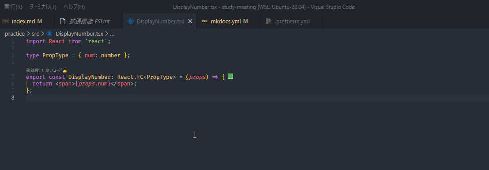

# Linter と Formatter

## 概要

ソースコードを書く上で、Linter と Formatter があると無いとでは効率が大きく異なります。

Linter は、構文チェックです。これは、言語仕様として間違っているところだけではなく、推奨されない書き方を警告したり、場合によっては自動的に修正してくれます。

Formatter は、コードの整形ツールです。コードの読みやすさに貢献します。また、チームで開発する場合、インデントの数が開発者によって異なると、gitなどの構成管理ツールでインデントの変更だけで履歴が作成されてしまい、本当に確認すべき変更点を見つけにくくなってしまいます。

いずれも、ルールをカスタマイズすることができ、チームごとに定義されたコーディング規約を機械的に守らせることができるので、レビューでの最低限のチェックを省くことも出来ます。

殆どの言語には Linter / Formatter のツールが用意されているので、積極的に利用しましょう。

ここでは、JavaScript / TypeScript のこれらについて説明します。

## ESLint

[ESLint - Pluggable JavaScript linter](https://eslint.org/)

ESLint は、JavaScript の　Linter で、プラグインを導入することで、TypeScript にも対応できます。

ルールの種類は 200 以上あり、環境や好みに合わせた柔軟な設定ができます。
[List of available rules - ESLint - Pluggable JavaScript linter](https://eslint.org/docs/rules/)

その一方でそんなに数があると、自分で1つ1つ設定するのは非常に困難です。そこで、ルールのセットも用意されており、これをベースに一部を上書き、追加することが通常の利用方法だと思います。

そのセットも、ESLint 標準のもの、Google の JavaScript スタイルガイドに沿ったもの、Airbnb のスタイルガイドに沿ったもの、などが公開されておりそれらを利用することも出来ます。

実際にその効果を試してみましょう。

前の講座で React を作成したフォルダがあればそれを利用しましょう。

まずは、ESLint を `yarn add` で導入します。開発環境で使うものなので、`-D` を忘れないようにします。

```
yarn add -D eslint
```

ESLint のルールや動作の設定は、`.eslintrc` ファイルに書く必要がありますが、これは
ウィザードで作成することが出来ます。下記コマンドで開始できます。

```
yarn eslint --init
```

```
? How would you like to use ESLint? … 
  To check syntax only
  To check syntax and find problems
▸ To check syntax, find problems, and enforce code style
```

はじめの質問は、ESLint でチェックする内容です。ここで一番下のものを選択すると、後ほど、Google や Airbnb のコーディング規約を選択できます。

```
? What type of modules does your project use? … 
▸ JavaScript modules (import/export)
  CommonJS (require/exports)
  None of these
```

次は、モジュール参照の仕方を聞いています。TypeScript を使うので、一番上の `JavaScript modules` を選択します。

```
? Which framework does your project use? … 
▸ React
  Vue.js
  None of these
```

次は、使用するフレームワークがあればそれを選択します。ここでは、React を使うのでそれを選択します。

```
? Does your project use TypeScript? ‣ No / Yes
```

TypeScript を使うので、`Yes` です。

```
 ? Where does your code run? …  (Press <space> to select, <a> to toggle all, <i> to invert selection)
✔ Browser
  Node
```

プログラムは、ブラウザで動作するものか、Node.js で動作するものかを選択します。両方選択することも出来ます。ここでは、`Browser` を選択しておきましょう。

```
? How would you like to define a style for your project? … 
▸ Use a popular style guide
  Answer questions about your style
  Inspect your JavaScript file(s)
```

コードスタイルのガイドラインの利用を選択します。ここでは、ポピュラーなスタイルガイドを利用したいので `Use a popular style guide` を選択します。

```
? Which style guide do you want to follow? … 
  Airbnb: https://github.com/airbnb/javascript
  Standard: https://github.com/standard/standard
▸ Google: https://github.com/google/eslint-config-google
  XO: https://github.com/xojs/eslint-config-xo
```

コードスタイルを選択します。好みで選んでよいのですが、ここでは `Google` のものを選択しておきましょう。

```
? What format do you want your config file to be in? … 
  JavaScript
▸ YAML
  JSON
```

`.eslint` をどの形式で書くかを聞いています。どれでも問題ないのですが、ここではYAML がシンプルでわかりやすいので、それを選択しましょう。

```
? Would you like to install them now with npm? ‣ No / Yes
```

必要な追加のパッケージをインストールするかと聞いてます。`Yes` とします。

ただし、今回は `yarn` を使っているので、処理が終わった後に `package-lock.json` を削除し、`yarn` で実行し直しておきます。

そうすることで、`yarn.lock` ファイルに追加したパッケージのバージョン情報を入れることが出来ます。

```
rm ./package-lock.json
yarn
```

追加で、React Hooks の プラグインも入れます。

```
yarn add -D eslint-plugin-react-hooks
```

このプラグインを適用するため、`.eslintrc.yml` に追加します。

```yaml
plugins:
  - react
  - "@typescript-eslint"
  - react-hooks # <- add
rules:
  react/prop-types: "off"
  react-hooks/rules-of-hooks: "error" # <- add
  react-hooks/exhaustive-deps: "warn" # <- add
```

早速チェックしてみます。下記コマンドで実行します。

```
yarn eslint ./src/**/*
  ...
  1:19  error  Strings must use singlequote  quotes
  ...
  1:16  error  There should be no space after '{'   object-curly-spacing
  ...
  20:48  error  'onClick' is missing in props validation  react/prop-types
  21:14  error  'caption' is missing in props validation  react/prop-types
```

色々エラーが出ました。

`quotes` や `object-curly-spacing` とあるのは、コードの整形に関するものです。これは、後ほど Prettier の方で定義しますので、今は無視してください。

`react/prop-types` は、React でプロパティの型チェックを推奨するルールのために発生しています。

しかし、これは TypeScript で型指定されているので、今回のこれについては必要のないエラーです。ルールでこれを off にしましょう。

エラーメッセージの末尾にあるのが、ルール名です。これをコピーします。そして、`.eslintrc.yml` ファイルに、ルールを追加します。

```yaml
rules:
  react/prop-types: "off"
```

再度テストを実行すると、エラーが無くなっていることが確認できます。

今度は、 `--fix` をつけて実行します。

```
yarn eslint ./src/**/* --fix
```

すると、エラーが表示されなくなりました。コードを見ると、文字列リテラルが、シングルクォーテーションに変わっています。また、{ } の間のスペースが無くなりました。

このように、全てではないですがこのように自動修正できるルールもあります。

React Hooks のプラグインの効果を見てみます。`Increment.tsx` を開き、useCallback の第2引数の配列を空にしてみます。

```tsx
  const decrement = useCallback(() => {
    setCounter(counter - 1);
  }, []);
```
eslint を実行すると、下記のような warning が出ます。

```
  12:6  warning  React Hook useCallback has a missing dependency: 'counter'. Either include it or remove the dependency array. You can also do a functional update 'setCounter(c => ...)' if you only need 'counter' in the 'setCounter' call  react-hooks/exhaustive-deps
```

これは、`useCallback` の関数の中で使っている変数を、第2引数に定義していない場合に警告されます。第2引数に値が入っていないと、関数が更新されず、関数内の変数も初期の状態が保持され、その変数が変更されても関数の結果が変わらない、ということになります。

React Hooks ではこれを忘れやすいのですが、ESLint で警告してくれるのでミスが少なくなります。

ESLint をいちいちコマンド打つのは面倒です。Visual Studio Code などのソースコードエディタやIDEでは、ESLint の拡張を入れることでソースコードにリアルタイムで警告を出すことが出来ます。

[ESLint - Visual Studio Marketplace](https://marketplace.visualstudio.com/items?itemName=dbaeumer.vscode-eslint)

## Prettier

[Prettier · Opinionated Code Formatter](https://prettier.io/)

Prettier は、多くのプログラム言語に対応したコードフォーマッタです。自動で修正もしてくれます。

もちろん、JavaScript / TypeScript に対応しています。

インストールして試してみます。

```
yarn add prettier
```

ルールは、`.prettierrc.yml` ファイルに書きます。

ルールの種類と設定値は、こちらにあります。

[Options · Prettier](https://prettier.io/docs/en/options.html)

ここで、その一覧を提示しておきます。そのまま定義ファイルとして利用できます。(v 2.4.1)

```yaml
# rules https://prettier.io/docs/en/options.html
printWidth: 80 # number, 1行の最大文字数
tabWidth: 2 # インデントの文字数, number
useTabs: false # boolean, インデントを Tab 文字とする場合は true, スペースの場合は false
semi: true # boolean, セミコロンを矯正する
singleQuote: true # 文字列リテラルをシングルクォーテーションで統一する
endOfLine: lf # 改行コード
quoteProps: as-needed # オブジェクトリテラルのプロパティ名にクォーテーションを使うか 以下の値が使用可能
#   "as-needed" - 必要なときのみ
#   "consistent" - オブジェクト内に必要があるものが1つでもあれば、全部つける
#   "preserve" - ユーザーの入力を尊重する -> prettier は関与しない
jsxSingleQuote: false # React などで使用する JSX のタグの属性の値で、シングルクォーテーションを使用する
#   例えば <input type="text" /> の "text" を 'text' とするか、という意味
trailingComma: all # オブジェクトリテラルや配列の最後のカンマを強制するか 以下の値が使用可能
#   "es5" - ES5で有効な場合は末尾のコンマをつける。
#   "none" - 末尾のコンマはつけない
#   "all" - 必ずつける ES2017 以降で有効
bracketSpacing: true # boolean オブジェクトリテラルの {} 内でスペースを開けるか
#   true - 例: { foo: bar }
#   false - 例: {foo: bar}
bracketSameLine: false # 複数行になるHTMLタグ(JSX(React), Vue.js も対象))の閉じ'>'を別の行に置くか
#   true
#     <button
#       id="prettier-id"
#       onClick={this.handleClick}>
#       Click Here
#     </button>
#   false
#     <button
#       id="prettier-id"
#       onClick={this.handleClick}
#     >
#       Click Here
#     </button>
arrowParens: always # Arrow関数の引数が省略できる時でも省略しないか
#   "always" - 常に省略しない. 例: (x) => x
#   "avoid" - 可能な場合は省略する 例: x => x
rangeStart: 0 # ファイル内のフォーマットの対象範囲 開始行
# rangeEnd: infinity # ファイル内のフォーマットの対象範囲 終了行　指定しない場合は末尾まで全部
# parser: babylon # 特定の言語のみを対象とする場合に、ここに列記する
#   指定できる値 https://prettier.io/docs/en/options.html#parser
requirePragma: false # ソースコードの先頭に プラグマコメントを書くことで、Prettier の対象を制限することができる
insertPragma: false # Prettier でフォーマットした時に ソースコードの先頭に requirePragma で有効なプラグマコメントを追加する
proseWrap: preserve # markdown などの時に、改行するかどうか
htmlWhitespaceSensitivity: css # HTML 内の空白文字の取り扱い
vueIndentScriptAndStyle: false # Vue.js テンプレートの <script>, <style> タグ内にインデントを含むかどうか
embeddedLanguageFormatting: auto # Markdown のコードブロックなど、別なコードの埋め込みを判断して対象とするか
```

試してみましょう。まずは構文としてはあっているけど、フォーマットがメチャクチャなソースコードを用意しましょう。

```ts
import React from 'react';

type PropType = { num: number };

export const DisplayNumber: React.FC<PropType> =
 (props)
  =>
   {
return <span>{props.num}</span>;
};
```

コマンドプロンプトで、prettier を実行します。

```
> yarn prettier ./src/DisplayNumber.tsx

import React from 'react';

type PropType = { num: number };

export const DisplayNumber: React.FC<PropType> = (props) => {
  return <span>{props.num}</span>;
};
```

結果として、整形されたコードが出力されました。通常はファイルを自動的に更新して保存したいでしょう。
その場合は、`-w` をつけて実行します。

```
> yarn prettier -w ./src/DisplayNumber.tsx
```

ファイルが書き換わりました。フォルダ内のファイルを一度に処理するには、下記のようにします。

```
> yarn prettier -w ./src/**/*
```

> ファイルパスには、Glob と呼ばれるパス指定方法が使用できます。   
> Prettier 以外にも採用しているツールは多いので、覚えておくと良いです。  
> https://github.com/mrmlnc/fast-glob#pattern-syntax

VSCode の拡張として Prettier があるので、これを入れておくとコマンドを打つことなく、コードを書きながら整形ができて効率的です。

[Prettier - Code formatter - Visual Studio Marketplace](https://marketplace.visualstudio.com/items?itemName=esbenp.prettier-vscode)
インストールしたら、デフォルトのフォーマッタとして登録しましょう。

++ctrl+shift+p++ -> [ドキュメントのフォーマット...] -> [規定のフォーマッタを構成...] -> [Prettier]



エディタ上でのフォーマットは、 ++shift+alt+f++ でできます。

また、設定で保存時に自動的にフォーマットをする、というオプションもあります。

これらにより、コードを書くと気にフォーマットを気にせず、ロジックを書くことに集中できるようになります。

## ESLint と　Prettier の組み合わせ

ESLint には、フォーマッタの機能もあるのですが、後述する Prettier の方が性能がよいので、組み合わせて使われます。

具体的には、ESLint のフォーマットに関するルールを無効にして、Prettier に依存することになります。

そのための方法が、Prettier の公式のサイトに書かれています。

[Integrating with Linters · Prettier](https://prettier.io/docs/en/integrating-with-linters.html)

> 以前は、公式の連携方法として、ESLint のエラーとして、Prettier のフォーマット違反を出力するようにしていましたが、
> 現在では、エラーとはせず、eslint の --fix で Prettier のフォーマットも行うことが推奨されています。  
> 理由としては、下記があります。
> 
> - エディターに赤いニョロニョロがたくさん出てくる。Prettier は format のことを気にしなくてもいいようにさせるツールなのに、フォーマットの警告が前面にでてきてしまう。
> - 直接 Prettier を実行するより遅い
> - レイヤーをひとつ挟んでおり、不整合が起きる可能性がある
> 
> 確かに、VSCode などのエディタでもフォーマットを直ちに行う事ができるので、ツールでエラーを出すこともないと思います。

ESLint のフォーマット関連のルールを無効化するプラグインをインストールします。

```
yarn add -D  eslint-config-prettier
```

.eslintrc.yml の extends に下記を追加します。

```yaml
extends:
  # 他の extends
  - prettier
```

これで、エディタ上でフォーマットに関するエラーが出なくなりました。

npm スクリプトで、eslint と prettier を一緒に書けるようにコマンドを定義します。

```json
{
  "scripts": {
    // 他のスクリプト
    "fix": "yarn prettier -w ./src/**/* && yarn eslint --fix"
  }
}
```

## まとめ

ESLint と Prettier について説明しました。

これらのルールは多岐にわたるので、プロジェクトに合わせて設定してみて下さい。

また、組織で Recommend の定義を作っておくことで、開発者が統一したルールで作業できるので、さらに効率が上がるのではないでしょうか？

これらは、JavaScript の開発ではデファクト・スタンダードなものですが、モジュールバンドラやテストなども含めて様々なツールを組み合わせることが必要です。

それは、それぞれツールを入れ替えるなどして柔軟な対応ができる反面、めんどくさくもあります。

現在、それらを統一したツールを作成しようと、Rome というプロジェクトが立ち上がっています。

まだこれから、というものなので使用できるのはもう少し先になりそうですが、注目していきたいです。

https://rome.tools/
