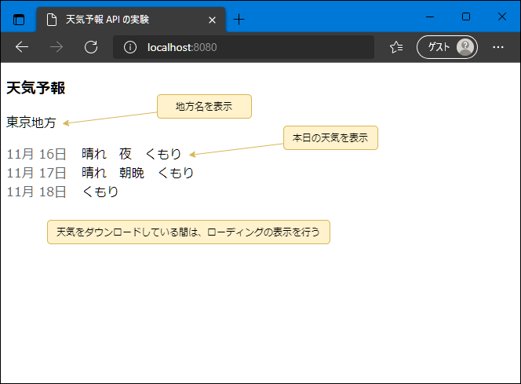
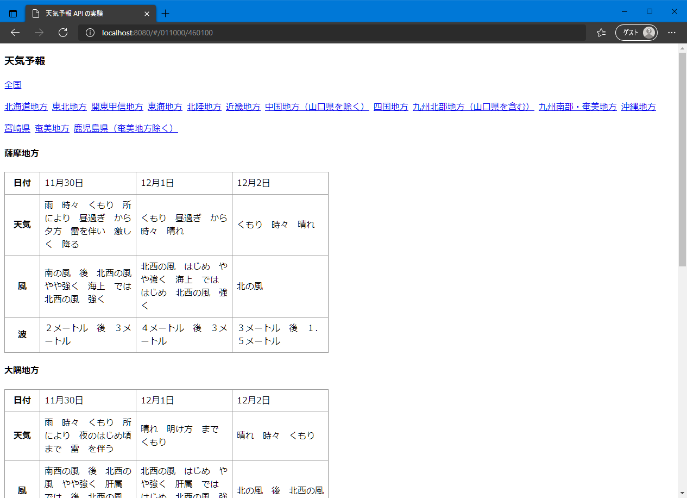

# 非同期処理の React での実践

## 目的

ここでは、React アプリの作成を通して、JavaScript での非同期処理の扱いを学習します。

Promise や async / await を使った関数を作成し、それを呼び出すコードを書くことで、非同期関数の扱いを学びます。

## アプリの目的

気象庁が天気予報の情報を API で提供しています。

> 正式には、公開されているAPIではありません。気象庁がホームページで利用している API を拝借しているだけです。  
> なので、公式のドキュメントもないですし、気象庁の都合で変更される可能性があります。  
> 利用に関しては、政府標準利用規約に準拠する必要があります。
> 
> - [気象庁公式の天気予報API（？）が発見 ～Twitterの開発者界隈に喜びの声が満ちる - やじうまの杜 - 窓の杜](https://forest.watch.impress.co.jp/docs/serial/yajiuma/1309318.html)  
> - [気象庁の中の人によるツイート](https://twitter.com/e_toyoda/status/1364504338572410885?ref_src=twsrc%5Etfw%7Ctwcamp%5Etweetembed%7Ctwterm%5E1364504338572410885%7Ctwgr%5E%7Ctwcon%5Es1_&ref_url=https%3A%2F%2Fforest.watch.impress.co.jp%2Fdocs%2Fserial%2Fyajiuma%2F1309318.html)  
> - [気象庁 | 著作権・リンク・個人情報保護について](https://www.jma.go.jp/jma/kishou/info/coment.html)

## アプリ仕様



- 画面表示時
    - 下記URLから、非同期でデータをロードする。  
      https://www.jma.go.jp/bosai/forecast/data/forecast/130000.json
    - ロード中はそれがわかるように、[スケルトン・ローダー](https://zenn.dev/kii/articles/progress-indicator-ui#%E6%8F%8F%E7%94%BB%E3%81%95%E3%82%8C%E3%82%8B-ui-%E3%81%AE%E5%9E%8B%3A%E3%82%B9%E3%82%B1%E3%83%AB%E3%83%88%E3%83%B3%E3%82%B9%E3%82%AF%E3%83%AA%E3%83%BC%E3%83%B3%EF%BC%88skeleton-screen%EF%BC%89)を表示する。
    - データが取得できたら、天気を日付別に表示する。
        - データには、複数の地方の情報が入っているが、一番上のデータを表示する。

> 他の都道府県の天気予報を取得する場合、`130000.json` の数値を書き変えます。  
> 都道府県ごとのコードは、下記で確認できる。  
> http://www.jma.go.jp/bosai/common/const/area.json

> スケルトン・ローダーは、npm パッケージ `react-loading-skeleton` を利用します。 


## プロジェクトの準備と動作

### 前提条件

PCに下記がインストールされていることを確認して下さい。

- `node.js@12.x+`
- `yarn@1.x`

> yarn@1 は、`npm install -g yarn` で入ります。

### スタートアップ プロジェクトの展開と実行

1. 今回のプロジェクトとして、スタートアップZIPを用意しています。これをフォルダに展開して下さい。

    [https://github.com/rits-ebihara/webdev-study/raw/master/s01-web%E3%82%A2%E3%83%97%E3%83%AA%E9%96%8B%E7%99%BA%E5%9F%BA%E6%9C%AC/docs/08.async-functions/async-sample-app-startup.zip](s01-webアプリ開発基本/docs/08.async-functions/async-sample-app-startup.zip)

    この中には、既に Webアプリとして動作するものが入っています。

2. ターミナルから、`yarn install` を実行します。
3. ターミナルで `yarn serve` を実行すると、Webアプリが起動します。

天気予報が表示されたと思いますが、これは通信を行って取得したのではなく、JSONファイルから取得して表示したものになります。

そのJSONファイルも、Webpack で同梱したも、つまりハードコーディングしたものになります。

データの読み込みとして、`src/WeatherNews.tsx` で `loadWeatherNews` 関数を定義しており、`setTimeout` を使って、非同期の処理をシミュレートしています。

これを、天気予報のURLから動的に取得するように変更します。

## コールバック関数による事後処理

まずは、Promise を使わずに、コールバック関数で事後処理を書きます。

`loadWeatherNews`関数では、既にコールバック関数が定義されており、一定時間後にこのコールバック関数を実行するようになっています。

```ts
const loadWeatherNews = (cb: (weatherData: Weather) => void) => {
  window.setTimeout(() => {
    cb(dummyData as Weather);
  }, 3000);
};
```

まずは、URLからデータを取得するようにします。最近のブラウザでは、`fetch`関数が実装されており、それでデータを取得することができます。

```ts
  fetch('https://www.jma.go.jp/bosai/forecast/data/forecast/130000.json').then(
    (response) => {
      response.json().then((data) => {
        cb(data[0]);
      });
    },
  );
```

`fetch`自体、`Promise` を返す関数なので、`then` を使っています。

レスポンスの `.json` で、レスポンスデータを JSON パースしてオブジェクトを返します。
これも `Promise` 関数になっているので、この `then` でコールバック関数を実行しています。

保存して実行してみます。

本日と明日（時間帯によっては明後日も）の天気予報が表示されたでしょうか？

一応、正しく動きますがネストが深いですね。`Promise` 化することで、コードをもっとスッキリさせましょう。

## 関数のプロミス化

まずPromise を使っているのに、`.then` がネストしているのはもったいないです。

このコードは下記のように書き変えることができます。

```ts
  fetch('https://www.jma.go.jp/bosai/forecast/data/forecast/130000.json')
    .then((response) => {
      return response.json();
    })
    .then((data) => {
      cb(data[0]);
    });
```

だいぶスッキリしました。

`.json` は、`Promise`関数なので、そのまま `return` して、メソッドチェーンで `.then` でその結果を受け取ります。

保存して実行して、結果が変わらないことを確認します。

次は、`loadWeatherNews` 関数自体も　`Promise` 化して、この関数を使う側のソースコードがスッキリ書けるようにしましょう。

```ts
const loadWeatherNews = () => {
  return new Promise<Weather>((resolve) => {
    fetch('https://www.jma.go.jp/bosai/forecast/data/forecast/130000.json')
      .then((response) => {
        return response.json();
      })
      .then((data) => {
        resolve(data[0]);
      });
  });
};
```

引数のコールバック関数を廃止し、`new Promise` したものを `return` するようにしました。

使う側で `.then` で結果を受け取るために、`resolve` でロードしたデータを渡しています。

また TypeScript では、Promise で返す値の型を明示する必要があります。`Promise` にジェネリック型で指定します。

使う側はこのようになります。

```ts
  useEffect(() => {
    loadWeatherNews().then((data) => {
      setWeatherData(data);
    });
  }, []);
```

保存して実行して、結果が変わらないことを確認します。

これでも良いんですが、そもそも `fetch` や `.json` が `Promise` を返すので、それをそのまま `return` することもできます。

使用側は何も変わりません。

```ts
const loadWeatherNews = () => {
  return fetch('https://www.jma.go.jp/bosai/forecast/data/forecast/130000.json')
    .then((response) => {
      return response.json();
    })
    .then((data) => {
      return data[0] as Weather;
    });
};
```

かなり簡潔になりました。このように、`Promise` をそのまま返すことで関数を `Promise` 化することもできます。

## async / await を利用する

`Promise` でも 全く問題はないのですが、async / await を使ってさらにコードを読みやすくします。

関数に `async` をつけて、非同期関数（実際には、`Promise` を返す関数）として宣言します。

`fetch`と`.json` の呼び出しで、`await` をつけて実行が完了するまで、それぞれの行で停止するようにします。

最後に `.json` の結果を返します。

```ts
const loadWeatherNews = async () => {
  const response = await fetch('https://www.jma.go.jp/bosai/forecast/data/forecast/130000.json');
  const data = await response.json();
  return data[0] as Weather;
};
```

ソースが単純明快になりました。非同期関数を `Promise` をあまり意識することなく書くことができるのがわかるかと思います。

これでも、前のソースと同じで `Promise` を返す関数なので、使用側のコードは変わりません。

保存して実行して、結果が変わらないことを確認してみてください。

## まとめ

非同期関数を作成して、それを利用したアプリを動かしてみました。

今回使用した `fetch` や `axios` などのHTTPクライアントのライブラリ、Node.js の DB クライアントやファイル操作など、I/O を行うライブラリは、その殆どが `Promise`化されており、自作の `Promise` 関数を作ることは、多くはないのではないかと思います。

ただ、await を使う場合は、async の関数である必要があり、つまりそれは `Promise` 関数を作ることになります。

ですので、`Promise` の扱いを身につけておく必要があります。

## おまけ

下記に、フルバージョンとして、全国の天気を見ることができソースを置いています。

`WeatherNews.tsx` の内容を差し替えて、`AreaType.ts` ファイルを追加して下さい。

React の参考としてください。

https://github.com/rits-ebihara/webdev-study/blob/main/async-functions/src/WeatherNews-full-version.tsx

https://github.com/rits-ebihara/webdev-study/blob/main/async-functions/src/AreaType.ts


